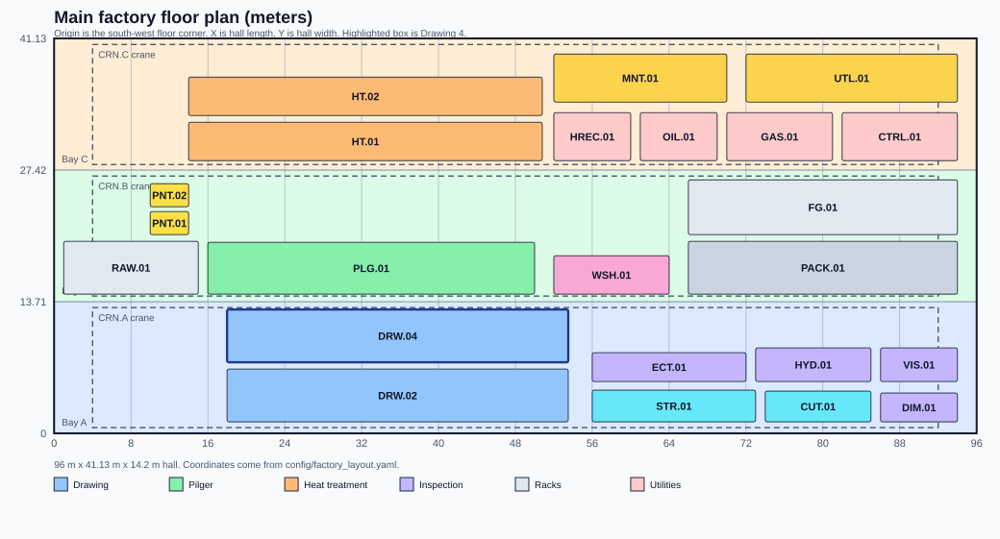

# Cold Drawing Digital Twin

A mill Digital Twin that reads live drawing-machine state, freezes it, runs a fast PINN check, and spends OpenRadioss FEA only when that check returns `NEED_FEA`.

## Problem

Cold drawing can leave a pass looking acceptable while local stress and strain are not. A full FEA on every sample is too slow for the line. A PINN-only answer is too weak when the case is outside the model domain or the mill has not validated a fracture threshold.

## Why AI + FEA + Digital Twin

| Layer | Role |
|---|---|
| OPC UA | Machine values with source time and quality |
| Digital Twin | Canonical live state in PostgreSQL / TimescaleDB |
| Snapshot | Immutable copy used for one Evaluation |
| PINN v0.1.1 | Fast SAFE / UNSAFE / NEED_FEA |
| Routing `routing-v1` | Fail-safe path selection |
| OpenRadioss | Selective high-fidelity drawing solve |
| Decision / Lineage | Stored verdict and the inputs that produced it |
| OpenUSD / Omniverse | Display of backend state, not a second decision engine |

## Architecture

```text
OPC UA → Digital Twin → Snapshot → PINN → Routing
                                      ├─ SAFE / UNSAFE → Decision
                                      └─ NEED_FEA → Gmsh/structured mesh → OpenRadioss
                                                    → quality gate → Decision / Manual review
Digital Twin → AAS/Submodels → BaSyx
Digital Twin → HTTP API → OpenUSD / Omniverse
```

## One real example

Asset: Drawing 4 (`BG.MIEUM.DRW.04`). Demo process vector: `0.3, 0.2, 0.08, 0.7`.

### Fast Path

```text
OPC UA → Twin → Snapshot → released PINN v0.1.1 → SAFE or UNSAFE → Decision → Lineage
```

No FEA.

### FEA Path

```text
Twin → Snapshot → released PINN v0.1.1 → NEED_FEA → OpenRadioss → quality gate → INCONCLUSIVE / MANUAL_REVIEW
```

This version has no validated FEA fracture threshold. A successful, quality-passing solve is therefore `INCONCLUSIVE`, not automatic SAFE/UNSAFE. Metrics are stored.

Out-of-domain PINN input (for example reduction ratio `0.55`) is a real `NEED_FEA` from `ReleasedPinnAdapter`. `StaticPinnAdapter` is a unit-test double only.

## 3D factory



Drawing 4 is a referenced hero asset (`usd/assets/drawing/Drawing_04.usda`) with Frame, Die, Workpiece, Entry, Exit, and StatusIndicator. `proxy` and `render` purposes share the same Digital Twin state.

```bash
make factory-stage
```

## Run

```bash
python -m pip install -e ".[dev]"
make fetch-pinn
make test
make seed-opcua
make demo-fast
make demo-fea
# or
make demo-system
```

OpenRadioss physics solve (optional, needs binaries):

```bash
bash scripts/install_openradioss.sh
export OPENRADIOSS_STARTER_BIN=$HOME/OpenRadioss/exec/starter_linux64_gf
export OPENRADIOSS_ENGINE_BIN=$HOME/OpenRadioss/exec/engine_linux64_gf
make fea-smoke
```

Compose (development-only passwords in `.env.example`):

```bash
cp .env.example .env
docker compose up -d
```

## Status of this version

| Item | State |
|---|---|
| HTTP API, Twin store, Snapshot, routing-v1 | Implemented |
| Released PINN adapter (`predict.py` + `pinn.pt`) | Implemented |
| OPC UA map as source of truth, source timestamp, quality | Implemented |
| AAS V3 ProcessState / EvaluationState / SimulationState | Implemented |
| OpenRadioss 2D axisymmetric drawing decks + parsers + quality gate | Implemented |
| `make fea-smoke` actual Engine solve | Reference implementation (NORMAL TERMINATION; Isolid=2; listing ERROR not saturated) |
| OpenRadioss on every CI run | Not implemented (manual `fea-integration.yml`) |
| Reference LAW36 steel card `stainless_reference_v1` | Reference implementation |
| Mill-calibrated plastic curve | Production calibration required |
| FEA automatic SAFE/UNSAFE thresholds | Production calibration required (`required_thresholds: []`) |
| Omniverse Kit runtime / WebRTC | Not implemented in this repository (host-side) |

PINN `normalized_hardening_coefficient` is not a megapascal material property.

## Read next

| Doc | What it covers |
|---|---|
| [docs/openradioss-fea.md](docs/openradioss-fea.md) | Formulation, material, contact, quality |
| [docs/architecture.md](docs/architecture.md) | How the parts connect |
| [docs/demo-acceptance.md](docs/demo-acceptance.md) | make targets |
| [docs/glossary.md](docs/glossary.md) | Shared names |
