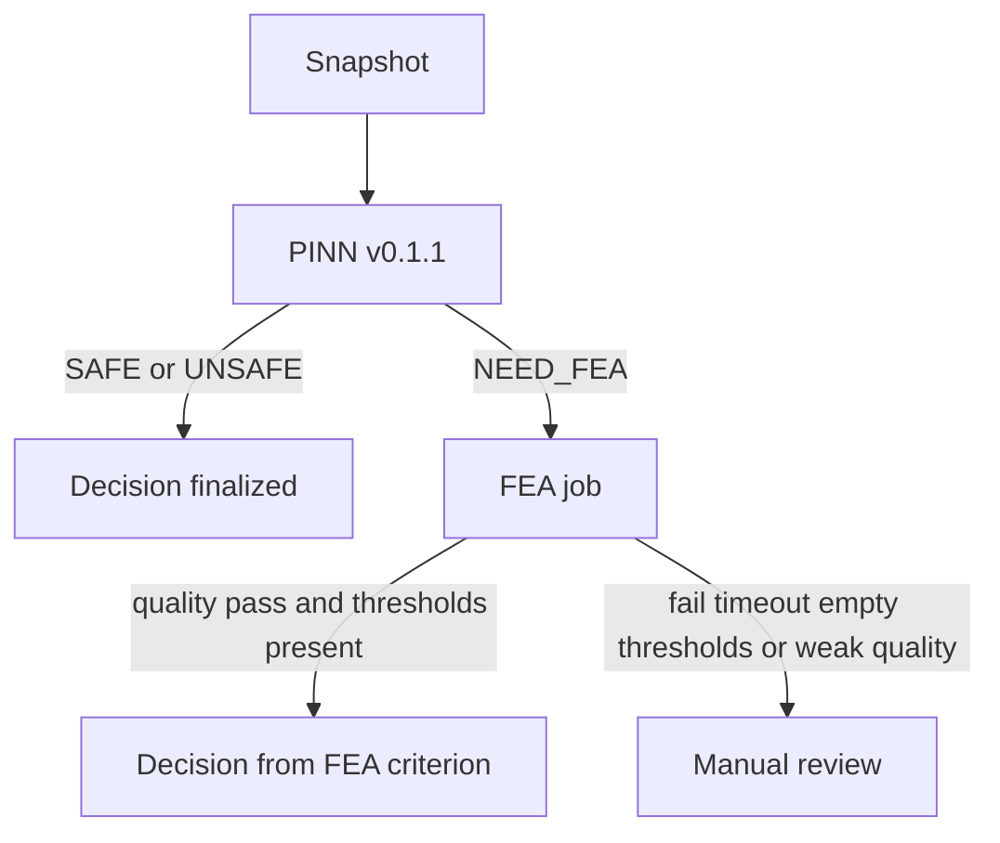

# Cold Drawing Digital Twin

On-site system for a cold drawing mill.

1. Read live process values from machines (OPC UA).
2. Freeze those values as a Snapshot.
3. Run a fast PINN safety check.
4. Run FEA only when the PINN result is `NEED_FEA`, or when site rules require it.
5. Store a Decision with Lineage.
6. Show the factory in OpenUSD. Omniverse Kit apps read the HTTP API.

If a word is new, see [docs/glossary.md](docs/glossary.md).

## Current version

| Item | Value |
|---|---|
| Product | 1.1 |
| PINN release | v0.1.1 |
| Routing policy | routing-v1 |
| FEA reference | fea-reference-v1 |
| FEA safety criterion | fea-criterion-v1 |
| Primary demo Asset | Drawing 4 (`BG.MIEUM.DRW.04`) |
| Factory hall | 96 m x 41.13 m x 14.2 m |

Present:

- HTTP API
- Digital Twin store (PostgreSQL / SQLite) with BaSyx sync when enabled
- Released PINN adapter (`predict.py` + `pinn.pt`)
- Routing policy `routing-v1`
- Gmsh axisymmetric mesh and OpenRadioss deck writer
- Celery FEA worker (or inline runner)
- Factory OpenUSD stage generator and Kit app shells

Not filled:

- FEA numeric safety thresholds (`required_thresholds` is empty, so FEA cannot return automatic `SAFE` / `UNSAFE`)
- Calibrated hardening curve numbers behind `hardening-map-v1`
- Omniverse Kit runtime and WebRTC (those run on the site RTX host)

## Worked example: one check on Drawing 4

Live Evaluation does not send process numbers from a client. The server copies them from the Digital Twin.

```bash
python -m pip install -e ".[dev]"
make fetch-pinn
make demo-fast
```

Snapshot numbers used by the docs and demos: `0.3, 0.2, 0.08, 0.7`.



## Factory floor

This picture is drawn from [config/factory_layout.yaml](config/factory_layout.yaml). The thick box is Drawing 4.


```bash
python scripts/render_factory_layout.py
make factory-stage
```

## Run locally

```bash
python -m pip install -e ".[dev]"
make test
make api
```

On-site layout: [docs/deployment.md](docs/deployment.md) and `compose.yaml`.

Check contracts:

```bash
python -m pip install -r requirements-ci.txt
python scripts/validate_contracts.py
```

## Read next

| Doc | What it covers |
|---|---|
| [docs/README.md](docs/README.md) | Full document map |
| [docs/glossary.md](docs/glossary.md) | Shared names |
| [docs/architecture.md](docs/architecture.md) | How the parts connect |
| [docs/api-contracts.md](docs/api-contracts.md) | Data shapes and HTTP API |
| [docs/factory-reconstruction.md](docs/factory-reconstruction.md) | Hall size, grid, and Asset coordinates |
| [docs/repository.md](docs/repository.md) | Source layout |
| [docs/contribution-units.md](docs/contribution-units.md) | Branch and commit size |
| [docs/demo-acceptance.md](docs/demo-acceptance.md) | make targets |

How to propose a change: [Contributing](.github/CONTRIBUTING.md).
