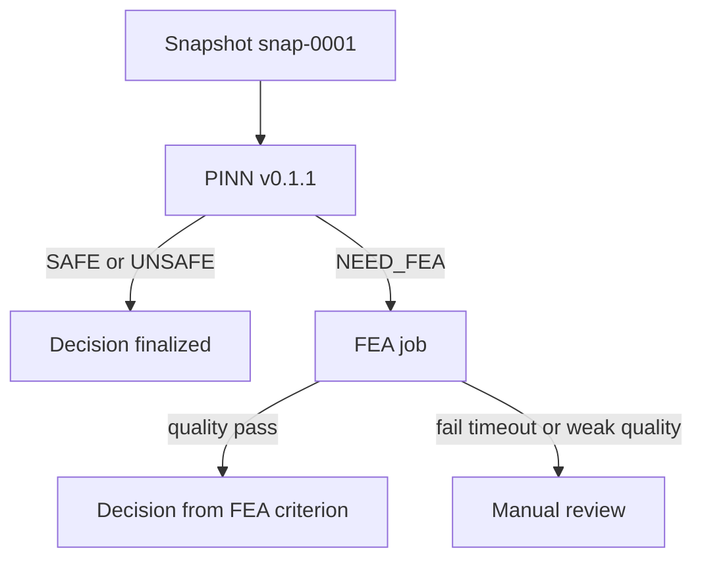

# Cold Drawing Digital Twin

This project designs an on-site system for a cold drawing mill.

The system will:

1. Read live process values from machines.
2. Freeze those values as a Snapshot.
3. Run a fast PINN safety check.
4. Run FEA only when the PINN result is `NEED_FEA`, or when site rules require it.
5. Store a Decision with Lineage.
6. Show the factory in 3D.

This version is **contracts and documentation**. There is no running API, PINN adapter, FEA worker, or 3D app yet.

If a word is new, see [docs/glossary.md](docs/glossary.md).

## Current version

| Item | Value |
|---|---|
| Contract set | 1.1 |
| PINN release | v0.1.1 |
| Routing policy | routing-v1 |
| FEA reference | fea-reference-v1 |
| FEA safety criterion | fea-criterion-v1 |
| Primary demo Asset | Drawing 4 (`BG.MIEUM.DRW.04`) |
| Factory hall | 96 m x 41.13 m x 14.2 m |

Not filled in this version:

- FEA numeric safety thresholds (`required_thresholds` is empty)
- Hardening curve numbers behind `hardening-map-v1`
- Application source code

## Worked example: one check on Drawing 4

Live Evaluation does not send process numbers from a client. The server copies them from the Digital Twin.

Snapshot used by the docs:

```json
{
  "snapshot_id": "snap-0001",
  "asset_id": "BG.MIEUM.DRW.04",
  "captured_at": "2026-09-14T16:00:00Z",
  "source_state_version": "state-0001",
  "features": {
    "reduction_ratio": 0.3,
    "die_half_angle_rad": 0.2,
    "friction_coefficient": 0.08,
    "normalized_hardening_coefficient": 0.7
  }
}
```

Two paths that Snapshot can take:



Fast-path Decision example: [docs/examples/decision.example.json](docs/examples/decision.example.json)

FEA-needed PINN result example: [docs/examples/prediction_result.example.json](docs/examples/prediction_result.example.json)

## Factory floor

This picture is drawn from [config/factory_layout.yaml](config/factory_layout.yaml). The thick box is Drawing 4.


Rebuild the picture:

```bash
python scripts/render_factory_layout.py
```

Check that IDs, schemas, and examples still agree:

```bash
python -m pip install -r requirements-ci.txt
python scripts/validate_contracts.py
```

## Read next

| Doc | What it covers |
|---|---|
| [docs/README.md](docs/README.md) | Full document map |
| [docs/glossary.md](docs/glossary.md) | Shared names |
| [docs/architecture.md](docs/architecture.md) | How the parts connect |
| [docs/api-contracts.md](docs/api-contracts.md) | Data shapes and planned HTTP API |
| [docs/factory-reconstruction.md](docs/factory-reconstruction.md) | Hall size, grid, and Asset coordinates |
| [docs/repository.md](docs/repository.md) | What exists now and what comes later |
| [docs/contribution-units.md](docs/contribution-units.md) | Branch and commit size |

