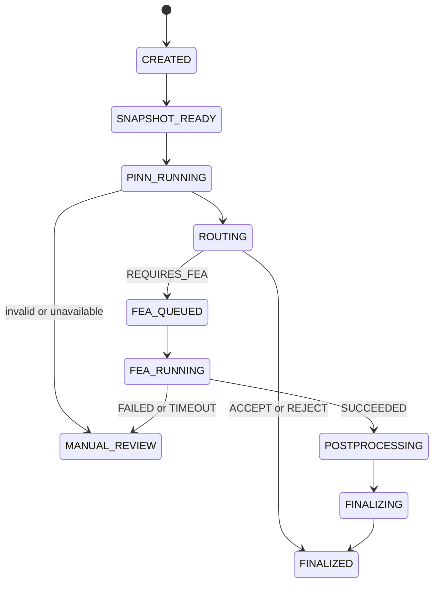

# PINN and FEA flow

Terms: [glossary](glossary.md).

This version runs the flow in `src/cold_drawing_twin`. PINN inference needs the released files under `models/`. OpenRadioss needs site binaries. The mill plastic curve is still empty; FEA uses the versioned reference material profile `stainless_reference_v1`.

## PINN artifact

Release: Cold Drawing PINN v0.1.1

Files: https://huggingface.co/MongsangGa/cold-drawing-pinn-poc

Local call:

```bash
make fetch-pinn
make model-verify
```

That list is the glossary feature order. The same numbers are in [examples/process_snapshot.example.json](examples/process_snapshot.example.json).

Output fields:

- `SAFE`, `UNSAFE`, or `NEED_FEA`
- stress indicator
- damage indicator
- physics residual
- model version
- optional probability or confidence (`null` means unused)

## Adapter rule

The product does not reimplement model math. It calls the released files through a stable adapter and records version and checksum.

```text
Snapshot -> feature builder -> range check -> local PINN -> parsed result
```

## Routing

Source: [config/routing_policy.yaml](../config/routing_policy.yaml), version `routing-v1`.

Order:

1. Required Digital Twin data missing -> `MANUAL_REVIEW`
2. Digital Twin stale -> `MANUAL_REVIEW`
3. PINN missing or invalid -> `MANUAL_REVIEW`
4. PINN returns `NEED_FEA` -> `REQUIRES_FEA`
5. Site policy requires FEA -> `REQUIRES_FEA`
6. PINN returns `UNSAFE` -> `REJECT`
7. PINN returns `SAFE` -> `ACCEPT`

Do not invent a probability cutoff. This PINN release does not require one.

## Evaluation states



## Why UNSAFE does not always start FEA

FEA is extra physics work for cases that need more check. A covered `UNSAFE` result does not need a second solve only because it is unsafe. The PINN already emits `NEED_FEA`. That is the main FEA trigger, plus data-quality and site rules.

## Queue

Queues:

- `fea.default`
- `fea.priority`

Worker rules for long jobs:

- Late acknowledgement
- Low prefetch
- Persist the job row and unpublished `fea_outbox` row, then **commit**, then publish
- Idempotent tasks (a second delivery of a non-`QUEUED` job is a no-op)
- Subprocess timeout and process-group cleanup
- Celery `task_time_limit` sits above `fea_job_timeout_s`
- Commit `RUNNING` with `work_dir` before the solver, then heartbeat the lease until it returns

HTTP and `make demo-fea` with `FEA_EXECUTION=celery` return `FEA_QUEUED` without waiting for OpenRadioss. The worker writes the Decision. `FEA_EXECUTION=inline` (local default) still runs the solver in-process after the job row is flushed.

Job states:

`PENDING -> QUEUED -> RUNNING -> SUCCEEDED or FAILED or TIMEOUT or CANCELLED`

## Idempotency

Reuse a successful FEA result when this hash matches, unless a person asks to rerun:

```text
hash(
  snapshot_id,
  fea_profile_version,
  material_mapping_version,
  mesh_config_version,
  solver_version,
  safety_criterion_version
)
```

## FEA code layout

```text
simulation/
  preprocess/
    parameter_mapping.py
    geometry.py
    mesh.py
    radioss_deck.py
  solver/
    openradioss.py
  postprocess/
    fields.py
    energy.py
    force.py
    damage.py
    safety_criterion.py
```

## Final Decision after FEA

Solver success creates an FEA result object. A separate versioned criterion then returns `SAFE`, `UNSAFE`, or `INCONCLUSIVE`. `INCONCLUSIVE` goes to Manual review.

This version's criterion evaluator is not implemented (`automatic_verdict_enabled: false`). Filling `required_thresholds` cannot produce automatic SAFE/UNSAFE. See [config/fea_safety_criterion.yaml](../config/fea_safety_criterion.yaml).
