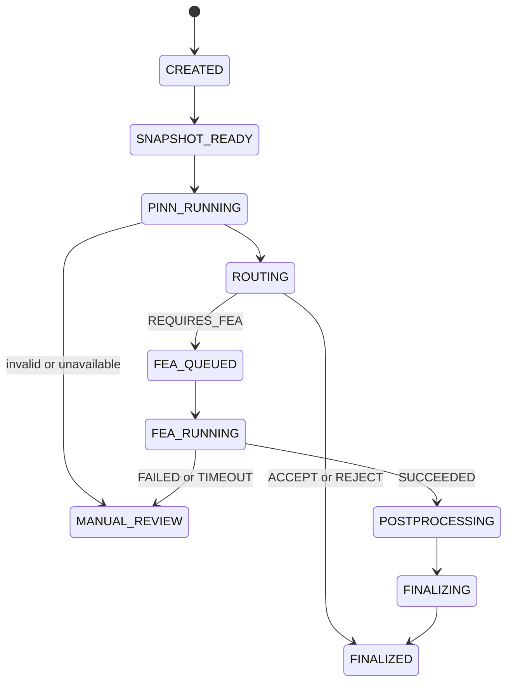

# PINN and FEA flow

Terms: [glossary](glossary.md).

This version defines the flow. It does not run PINN or OpenRadioss yet.

## PINN artifact

Release: Cold Drawing PINN v0.1.1

Files: https://huggingface.co/MongsangGa/cold-drawing-pinn-poc

Planned local call:

```bash
python predict.py --features 0.3 0.2 0.08 0.7
```

That list is the glossary feature order. The same numbers are in [examples/process_snapshot.example.json](examples/process_snapshot.example.json).

Output fields:

- `SAFE`, `UNSAFE`, or `NEED_FEA`
- stress indicator
- damage indicator
- physics residual
- model version
- optional probability or confidence (`null` means unused)

## Adapter rule

The product does not reimplement model math. It calls the released files through a stable adapter and records version and checksum.

```text
Snapshot -> feature builder -> range check -> local PINN -> parsed result
```

## Routing

Source: [config/routing_policy.yaml](../config/routing_policy.yaml), version `routing-v1`.

Order:

1. Required Digital Twin data missing -> `MANUAL_REVIEW`
2. Digital Twin stale -> `MANUAL_REVIEW`
3. PINN missing or invalid -> `MANUAL_REVIEW`
4. PINN returns `NEED_FEA` -> `REQUIRES_FEA`
5. Site policy requires FEA -> `REQUIRES_FEA`
6. PINN returns `UNSAFE` -> `REJECT`
7. PINN returns `SAFE` -> `ACCEPT`

Do not invent a probability cutoff. This PINN release does not require one.

## Evaluation states



## Why UNSAFE does not always start FEA

FEA is extra physics work for cases that need more check. A covered `UNSAFE` result does not need a second solve only because it is unsafe. The PINN already emits `NEED_FEA`. That is the main FEA trigger, plus data-quality and site rules.

## Queue

Planned queues:

- `fea.default`
- `fea.priority`

Worker rules for long jobs:

- Late acknowledgement
- Low prefetch
- Persist the job row before launch
- Idempotent tasks
- Subprocess timeout and process-group cleanup

Job states:

`PENDING -> QUEUED -> RUNNING -> SUCCEEDED or FAILED or TIMEOUT or CANCELLED`

## Idempotency

Reuse a successful FEA result when this hash matches, unless a person asks to rerun:

```text
hash(
  snapshot_id,
  fea_profile_version,
  material_mapping_version,
  mesh_config_version,
  solver_version,
  safety_criterion_version
)
```

