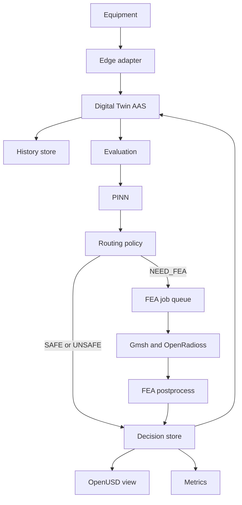

# System architecture

Terms: [glossary](glossary.md).

This version describes the running system. Contracts under `config/` and `schemas/` stay the engineering source for Lineage.

## Style

Each layer owns one job. A machine protocol, an AI model, a solver, or a 3D client must not own another layer's rules.

## Parts



## Who owns which data

| Data | Owner |
|---|---|
| Asset identity and live meaning | AAS / BaSyx |
| Time history of measurements | TimescaleDB |
| Evaluation and Decision lifecycle | PostgreSQL tables |
| PINN files and version | Local model manifest |
| FEA job lifecycle | Database row plus queue |
| FEA raw files | On-site artifact store |
| Spatial factory | OpenUSD |
| Metrics | Prometheus series listed as Implemented in [observability-reliability.md](observability-reliability.md) |

## Two check paths

Fast path, from the demo Snapshot `snap-0001`:

```text
state change -> Snapshot -> PINN -> SAFE or UNSAFE -> Routing policy -> Decision
```

FEA path, from demo PINN result `NEED_FEA`:

```text
state change -> Snapshot -> PINN NEED_FEA -> FEA job -> Gmsh -> OpenRadioss -> criterion -> Decision
```

Failure path in this version's routing file:

```text
required FEA -> FAILED or TIMEOUT or INCONCLUSIVE -> MANUAL_REVIEW
```

See [examples/decision.example.json](examples/decision.example.json) and [examples/decision_fea.example.json](examples/decision_fea.example.json).

## Layer jobs

### Edge adapter

- Talk to OPC UA
- Map nodes to domain fields
- Keep source time and quality
- Reconnect with backoff

### Digital Twin

- Asset identity
- Current process, material, Evaluation, and FEA state

### History store

- Measurements and state changes
- Snapshot source references
- Timeline queries

### Evaluation

- Freshness check
- Immutable Snapshot
- PINN call
- Routing policy
- FEA job create
- Lineage save

### PINN adapter

- Build features in the glossary order
- Check supported ranges
- Call the released local model
- Parse `SAFE`, `UNSAFE`, `NEED_FEA`

### FEA pipeline

- Map process features to physical inputs
- Build geometry and mesh
- Run OpenRadioss
- Apply the versioned safety criterion

### OpenUSD view

- Factory layout
- Live and history overlays
- FEA field view
- Senior and operator apps

## Scenario boundary

A Scenario starts from a Snapshot, applies overrides, and stores its own Evaluation. It must not change live Digital Twin state unless a person later accepts that change.
