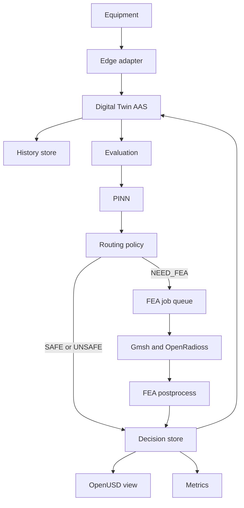

# System architecture

Terms: [glossary](glossary.md).

This version describes the target system. Only contracts exist today.

## Style

Each layer owns one job. A machine protocol, an AI model, a solver, or a 3D client must not own another layer's rules.

## Parts

## Who owns which data

| Data | Owner |
|---|---|
| Asset identity and live meaning | AAS / BaSyx |
| Time history of measurements | TimescaleDB |
| Evaluation and Decision lifecycle | PostgreSQL tables |
| PINN files and version | Local model manifest |
| FEA job lifecycle | Database row plus queue |
| FEA raw files | On-site artifact store |
| Spatial factory | OpenUSD |
| Metrics | Prometheus |

