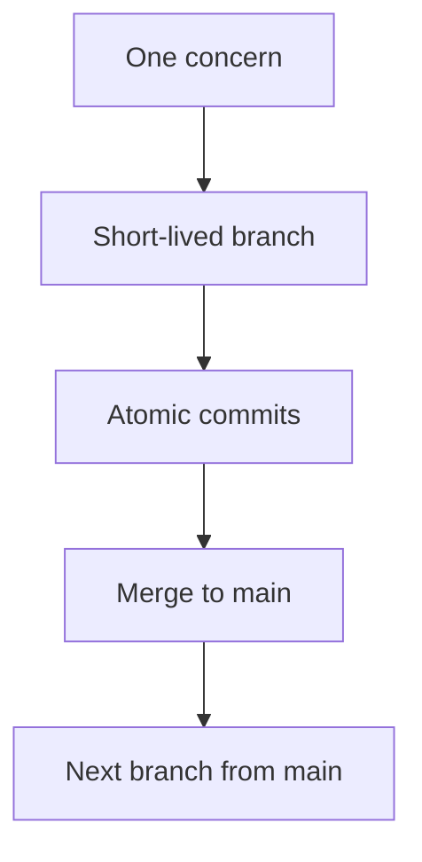

# Branches and commits

This repository lands work on `main` from short-lived topic branches.

## Sources

- [GitHub Flow](https://docs.github.com/en/get-started/using-github/github-flow): one short-lived branch per related change; each commit is an isolated, complete change.
- [Google Small CLs](https://google.github.io/eng-practices/review/developer/small-cls.html): one self-contained change; about 100 lines is often enough; about 1000 lines is usually too large; related tests stay with the change; refactorings stay separate; the tree must keep working after each land.
- [Conventional Commits 1.0.0](https://www.conventionalcommits.org/en/v1.0.0/): `type(scope): summary`. If a change fits more than one type, make more than one commit.

## Flow



## Branch

Create the branch from current `main`. Do not commit on `main` during active work.

Name:

```text
<type>/<short-slug>
```

`type` matches Conventional Commits: `feat`, `fix`, `docs`, `ci`, `chore`, `refactor`, `test`.

Examples:

- `docs/glossary`
- `fix/snapshot-feature-order`
- `feat/pinn-adapter`
- `ci/contracts-workflow`

ASCII lowercase and hyphens only. Delete the branch after it lands on `main`.

