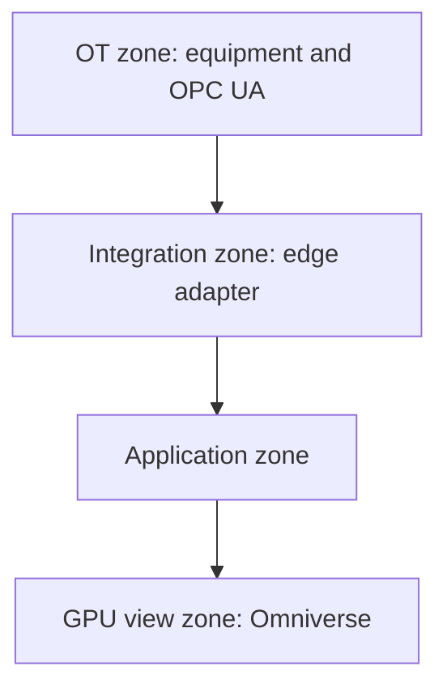

# On-site deployment

Terms: [glossary](glossary.md).

This version ships `compose.yaml`. Network zones may collapse on a laptop. The interfaces stay separate in code.

## Zones



Application zone services:

- API and Evaluation
- BaSyx
- PostgreSQL with TimescaleDB
- RabbitMQ
- Celery FEA workers
- PINN files
- FEA files
- Prometheus and Grafana

Network zones may collapse on a laptop. The interfaces stay separate in code.

## Compose services

- `api`
- `edge-adapter`
- `basyx`
- `postgres-timescale`
- `rabbitmq`
- `fea-worker`
- `prometheus`
- `grafana`

GPU host:

- `omniverse-kit-app`
- optional web stream client

OpenRadioss may run in the worker container or on a solver host the worker calls. That choice needs an ADR when implemented.

Set `FEA_EXECUTION=celery` on `api` and `fea-worker` (already in `compose.yaml`). The API process must not run the Engine. It commits the `QUEUED` job row, then publishes to RabbitMQ.

## Volumes

Keep separate:

- Database
- BaSyx state if needed
- Model files
- FEA job files
- OpenUSD assets
- Prometheus and Grafana state as needed

## Configuration

Secrets and site URLs use environment files. See [.env.example](../.env.example). Values there are development-only.

Engineering values stay in versioned repo files so they appear in Lineage:

- PINN ranges
- FEA material mapping
- Mesh profile
- Solver profile
- Safety criterion
- Routing policy

Do not hide those values only in environment variables.

## Startup

```text
DB and RabbitMQ
  -> BaSyx
  -> API and worker
  -> Edge adapter
  -> metrics
  -> Omniverse app
```

Readiness, not container start order alone, decides availability.

## Why Compose first

The first site is one factory. Reproducible service isolation matters now. Kubernetes waits until high availability, multi-node scheduling, or many GPU/FEA sessions are a real need.
