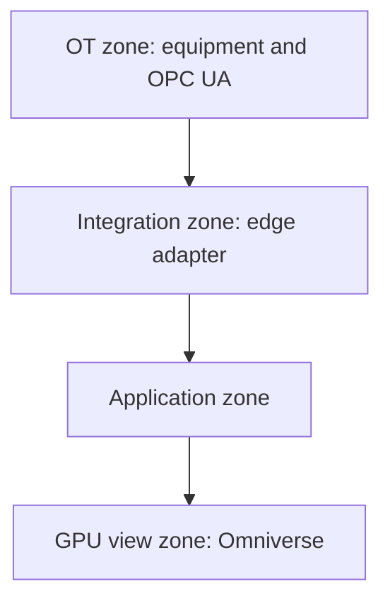

# On-site deployment

Terms: [glossary](glossary.md).

This version ships `compose.yaml`. Network zones may collapse on a laptop. The interfaces stay separate in code.

## Zones



Application zone services:

- API and Evaluation
- BaSyx
- PostgreSQL with TimescaleDB
- RabbitMQ
- Celery FEA workers
- PINN files
- FEA files
- Prometheus and Grafana

Network zones may collapse on a laptop. The interfaces stay separate in code.

## Compose services

- `api`
- `edge-adapter`
- `basyx`
- `postgres-timescale`
- `rabbitmq`
- `fea-worker`
- `prometheus`
- `grafana`

GPU host:

- `omniverse-kit-app`
- optional web stream client

OpenRadioss may run in the worker container or on a solver host the worker calls. That choice needs an ADR when implemented.

Set `FEA_EXECUTION=celery` on `api` and `fea-worker` (already in `compose.yaml`). The API process must not run the Engine. It writes the `QUEUED` job row and an unpublished `fea_outbox` row in one transaction, commits, then publishes the outbox to RabbitMQ. Two workers claim with `UPDATE ... WHERE status=QUEUED`. If publish fails, the outbox stays unpublished; `make fea-requeue` publishes those rows only.

Timeouts are not one number:

- `fea_job_timeout_s` (`FEA_JOB_TIMEOUT_S`) is the maximum for **one** OpenRadioss phase. Starter and Engine each get that budget.
- Celery soft/hard limits are computed from both phases plus conversion and a small orchestration grace (`fea_task_soft_limit_s` / `fea_task_hard_limit_s`). A healthy Starter that uses most of its phase budget must still leave time for Engine.
- After claim the worker writes `work_dir`, commits `RUNNING`, then renews `lease_expires_at` (heartbeat) while the solver runs. The initial lease matches the Celery hard limit.
- A Celery **soft** timeout on a `RUNNING` job becomes `TIMEOUT` / `INCONCLUSIVE` / `MANUAL_REVIEW`. It does not write SAFE.
- A Celery **hard** kill cannot finalize. `make fea-reclaim` inspects the lease. No `work_dir` returns the row to `QUEUED` and writes a new unpublished outbox row. A started work directory becomes `TIMEOUT` / `INCONCLUSIVE` so a second Engine is not launched on the same files. A late worker whose `claim_generation` no longer matches drops its result.

Kafka, Kubernetes, and Temporal are out of scope here.

## Volumes

Keep separate:

- Database
- BaSyx state if needed
- Model files
- FEA job files
- OpenUSD assets
- Prometheus and Grafana state as needed

## Configuration

Secrets and site URLs use environment files. See [.env.example](../.env.example). Values there are development-only.

Engineering values stay in versioned repo files so they appear in Lineage:

- PINN ranges
- FEA material mapping
- Mesh profile
- Solver profile
- Safety criterion
- Routing policy

Do not hide those values only in environment variables.

## Startup

```text
DB and RabbitMQ
  -> BaSyx
  -> API and worker
  -> Edge adapter
  -> metrics
  -> Omniverse app
```

Readiness, not container start order alone, decides availability.

## Why Compose first

The first site is one factory. Reproducible service isolation matters now. Kubernetes waits until high availability, multi-node scheduling, or many GPU/FEA sessions are a real need.

## Existing database volumes

SQLite tests call `create_all`. An existing PostgreSQL volume created before Snapshot `source_timestamp` / `ingest_timestamp` gets those columns from `make_session_factory` (`ALTER TABLE`). Legacy rows keep `source_timestamp` null and `source_timestamp_provenance=unknown`. The startup helper does not copy `captured_at` into `source_timestamp`. FEA lease columns (`lease_expires_at`, `claim_generation`) are added the same way. That is a startup ensure, not a migration framework.
