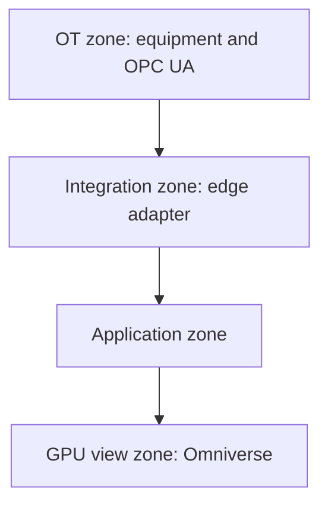

# On-site deployment

Terms: [glossary](glossary.md).

This version has no Compose file and no containers yet. The layout below is the target.

## Zones

Application zone services:

- API and Evaluation
- BaSyx
- PostgreSQL with TimescaleDB
- RabbitMQ
- Celery FEA workers
- PINN files
- FEA files
- Prometheus and Grafana

Network zones may collapse on a laptop. The interfaces stay separate in code.

## Planned Compose services

- `api`
- `edge-adapter`
- `basyx`
- `postgres-timescale`
- `rabbitmq`
- `fea-worker`
- `prometheus`
- `grafana`

GPU host:

- `omniverse-kit-app`
- optional web stream client

OpenRadioss may run in the worker container or on a solver host the worker calls. That choice needs an ADR when implemented.

