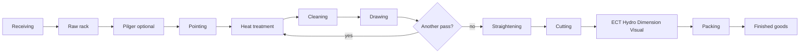

# Factory reconstruction

Terms: [glossary](glossary.md).

Source files:

- [config/factory_layout.yaml](../config/factory_layout.yaml)
- [config/asset_registry.yaml](../config/asset_registry.yaml)

This picture is generated from those files. Drawing 4 is the thick box.


Rebuild:

```bash
python scripts/render_factory_layout.py
```

## Coordinates

```text
Origin: south-west floor corner of the main hall
X+: hall length
Y+: hall width
Z+: up
Unit: meter
```

## Hall

```text
Length X: 96.00 m
Width Y: 41.13 m
Floor area: about 3948.5 m2
Maximum building height: 14.20 m
```

Grid X: `0, 8, 16, 24, 32, 40, 48, 56, 64, 72, 80, 88, 96`

Grid Y: `0, 13.71, 27.42, 41.13`

Halls:

- Bay A: Y 0.00 to 13.71
- Bay B: Y 13.71 to 27.42
- Bay C: Y 27.42 to 41.13

## Major envelopes

Sizes in meters. These are bounding boxes, not CAD.

| Asset | L | W | H | Job |
|---|---:|---:|---:|---|
| Drawing 2 | 35.5 | 5.5 | 2.8 | cold drawing |
| Drawing 4 | 35.5 | 5.5 | 2.8 | cold drawing |
| Pilger | 34.0 | 5.4 | 2.6 | cold pilger |
| Heat treatment 1 | 36.8 | 4.0 | 3.5 | heat and cool |
| Heat treatment 2 | 36.8 | 4.0 | 3.5 | heat and cool |
| Straightening | 17.0 | 3.3 | 2.3 | straighten |
| Cutting | 11.0 | 3.2 | 2.2 | cut |
| ECT | 16.0 | 3.0 | 2.2 | eddy-current inspect |
| Hydro test | 12.0 | 3.5 | 2.2 | pressure inspect |
| Dimension | 8.0 | 3.0 | 2.2 | size inspect |
| Washing | 12.0 | 4.0 | 2.5 | clean |

## Placed Assets

Lower-left of each envelope. This version places 23 machines or zones plus 3 cranes.

### Bay A - drawing and final inspection

| Asset ID | X | Y | L | W |
|---|---:|---:|---:|---:|
| BG.MIEUM.DRW.02 | 18.0 | 1.2 | 35.5 | 5.5 |
| BG.MIEUM.DRW.04 | 18.0 | 7.4 | 35.5 | 5.5 |
| BG.MIEUM.STR.01 | 56.0 | 1.2 | 17.0 | 3.3 |
| BG.MIEUM.CUT.01 | 74.0 | 1.2 | 11.0 | 3.2 |
| BG.MIEUM.DIM.01 | 86.0 | 1.2 | 8.0 | 3.0 |
| BG.MIEUM.ECT.01 | 56.0 | 5.4 | 16.0 | 3.0 |
| BG.MIEUM.HYD.01 | 73.0 | 5.4 | 12.0 | 3.5 |
| BG.MIEUM.VIS.01 | 86.0 | 5.4 | 8.0 | 3.5 |

### Bay B - pilger, handling, packing

| Asset ID | X | Y | L | W |
|---|---:|---:|---:|---:|
| BG.MIEUM.RAW.01 | 1.0 | 14.5 | 14.0 | 5.5 |
| BG.MIEUM.PNT.01 | 10.0 | 20.7 | 4.0 | 2.4 |
| BG.MIEUM.PNT.02 | 10.0 | 23.6 | 4.0 | 2.4 |
| BG.MIEUM.PLG.01 | 16.0 | 14.5 | 34.0 | 5.4 |
| BG.MIEUM.WSH.01 | 52.0 | 14.5 | 12.0 | 4.0 |
| BG.MIEUM.PACK.01 | 66.0 | 14.5 | 28.0 | 5.5 |
| BG.MIEUM.FG.01 | 66.0 | 20.7 | 28.0 | 5.7 |

### Bay C - heat treatment and utilities

| Asset ID | X | Y | L | W |
|---|---:|---:|---:|---:|
| BG.MIEUM.HT.01 | 14.0 | 28.4 | 36.8 | 4.0 |
| BG.MIEUM.HT.02 | 14.0 | 33.1 | 36.8 | 4.0 |
| BG.MIEUM.HREC.01 | 52.0 | 28.4 | 8.0 | 5.0 |
| BG.MIEUM.OIL.01 | 61.0 | 28.4 | 8.0 | 5.0 |
| BG.MIEUM.GAS.01 | 70.0 | 28.4 | 11.0 | 5.0 |
| BG.MIEUM.CTRL.01 | 82.0 | 28.4 | 12.0 | 5.0 |
| BG.MIEUM.MNT.01 | 52.0 | 34.5 | 18.0 | 5.0 |
| BG.MIEUM.UTL.01 | 72.0 | 34.5 | 22.0 | 5.0 |

## Cranes

| Asset ID | Y domain | X travel |
|---|---|---|
| BG.MIEUM.CRN.A | 0.6 to 13.1 | 4 to 92 |
| BG.MIEUM.CRN.B | 14.3 to 26.8 | 4 to 92 |
| BG.MIEUM.CRN.C | 28.0 to 40.5 | 4 to 92 |

Minimum crane parts: bridge, trolley, hook, runway, load attachment.

Digital Twin fields: `bridge_x`, `trolley_y`, `hook_z`, `load_state`, `operation_state`.

## Material flow



Long product can move along the hall or by overhead crane.

## Detail modeling order

1. Drawing 4
2. Pilger 1
3. Heat treatment 1
4. ECT 1
5. Crane A
6. Drawing 2
7. Straightening
8. Cleaning
9. Remaining inspection and utilities

## Drawing 4 parts

```text
Drawing_04
  Frame
  Bed
  MaterialRail
  Feed
  DieAssembly
    Die
    DieHolder
    LoadCellTop
    LoadCellRight
    LoadCellBottom
    LoadCellLeft
    AdjustmentMechanism
  Clamp
  Drive
  Servo
  OilSystem
  ControlPanel
  SafetyGuard
```

## Heat treatment 1 parts

```text
HT_01
  Infeed
  HeatingFurnace
  ConnectionSection
  CoolingSection
  Outfeed
  GasSupplyInterface
  HeatRecoveryInterface
  ControlPanel
```

Oil loop:

```text
Heating furnace -> heat recovery -> hot water tank -> oil tank -> pump -> drawing oil nozzle -> recovery reservoir
```

