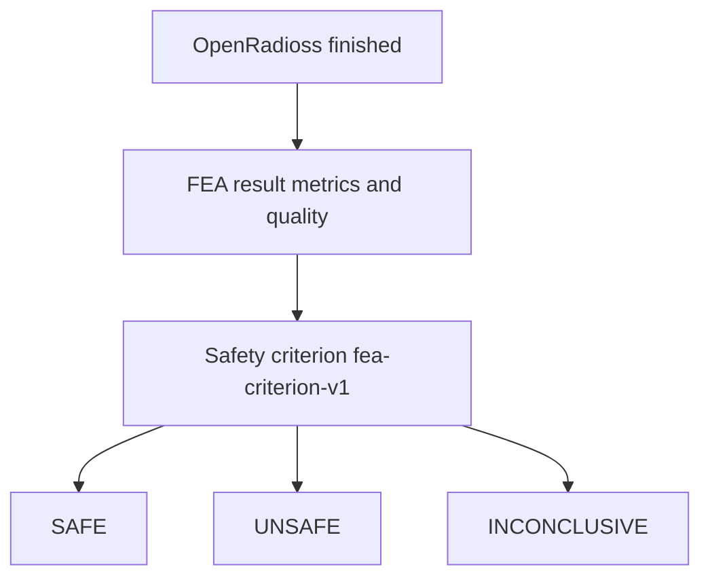

# OpenRadioss FEA

Terms: [glossary](glossary.md).

Goal: an executable FEA fallback for cold drawing.

```text
Process features
  -> physical mapping
  -> Gmsh axisymmetric geometry and mesh
  -> OpenRadioss Starter and Engine
  -> raw output
  -> postprocess
  -> versioned safety criterion
```

This version has the reference profile only. It does not run Gmsh or OpenRadioss yet.

## Why OpenRadioss

Cold drawing has large plastic strain and sliding friction. OpenRadioss is an explicit nonlinear solver that can run 2D axisymmetric elastoplastic contact.

The process is quasi-static. Explicit time stepping is allowed only if energy and force checks show that fake inertia is not driving the answer.

## First model

First case: round bar, 2D axisymmetric.

Geometry:

- Start radius from the reference profile
- Final radius from `reduction_ratio`
- Die cone from `die_half_angle_rad`
- Enough inlet and outlet contact length
- Rigid or very stiff die

Circular reduction:

```text
A_f = A_0 * (1 - reduction_ratio)
r_f = r_0 * sqrt(1 - reduction_ratio)
```

Demo Snapshot uses `reduction_ratio = 0.3` and `initial_radius_m = 0.01` from [config/fea_reference_case.yaml](../config/fea_reference_case.yaml):

```text
r_0 = 0.01 m
r_f = 0.01 * sqrt(1 - 0.3) = 0.00837 m
```

## Material mapping

PINN field `normalized_hardening_coefficient` is not MPa.

This version records IDs only:

- `material_profile_id: stainless_reference_v1`
- `mapping_version: hardening-map-v1`

The curve numbers are not in the repository yet. Do not treat the normalized scalar as a physical unit. A later calibrated card can replace the mapping without changing Evaluation contracts.

## Contact

`friction_coefficient` maps to die/material friction. Contact and penalty settings live in a versioned FEA profile, not as hidden constants. Demo value: `0.08`.

## Mesh

Gmsh Python API will build the 2D axisymmetric mesh.

- Finer near die entry, cone, and exit
- Coarser away from the deformation zone
- Deterministic size config
- Mesh stats and checksum

Mesh convergence is part of validation.

Reference sizes in this version:

- deformation zone `0.00035 m`
- far field `0.0010 m`

## Solver steps

```text
1. Create an isolated job directory
2. Write immutable inputs and config
3. Generate geometry and mesh
4. Write OpenRadioss Starter and Engine decks
5. Run Starter
6. Check Starter output
7. Run Engine with timeout
8. Parse solver status
9. Collect energy, field, and force output
10. Store artifacts and checksums
11. Run postprocess
```

## Quasi-static checks

Record at least:

- kinetic energy history
- internal energy history
- contact energy when available
- drawing force history
- deformation response

A job that misses the versioned quality rule is `INCONCLUSIVE`, not `SAFE` or `UNSAFE`.

Do not hard-code one kinetic/internal energy ratio as science. Keep the rule in a versioned quality profile and test it on reference cases. This version names that profile `quasi-static-quality-v1` and does not yet give numeric limits.

## Solver outputs

Keep when available:

- von Mises stress
- equivalent plastic strain
- reaction / drawing force
- displacement
- energy histories
- contact status / force
- critical-region coordinates

Damage is a separate postprocess unless a chosen OpenRadioss failure model is validated for that meaning.

## Safety criterion



Thresholds live in [config/fea_safety_criterion.yaml](../config/fea_safety_criterion.yaml). In this version `required_thresholds` is an empty list. The implementation must refuse automatic `SAFE` or `UNSAFE` when required thresholds are absent. Solver exit code is never a safety verdict.

## Planned CLI

```bash
python -m cold_drawing_twin.simulation.run \
  --reduction-ratio 0.30 \
  --die-angle-rad 0.20 \
  --friction 0.08 \
  --hardening 0.70
```

That command does not exist in this version. When it exists, it must run a real Gmsh -> OpenRadioss solve and print quality, metrics, criterion version, and verdict.

## Validation matrix

- Mesh coarse / medium / fine
- Time or mass-scaling sensitivity if used
- Friction sensitivity
- Reduction-ratio direction checks
- Die-angle sensitivity
- Hardening sensitivity
- Energy quality
- Repeatability with pinned solver and config
