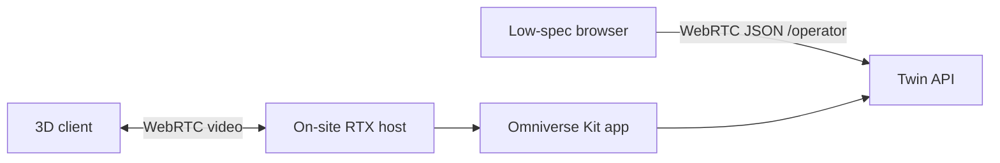

# OpenUSD and Omniverse

Terms: [glossary](glossary.md).

OpenUSD is the spatial source of truth. Omniverse Kit is the 3D app. Neither owns safety rules or process measurements.

This version generates `usd/factory/bugok_factory.usda` from layout YAML and ships Kit apps that call the HTTP API. Operator browsers can open `/operator` for a WebRTC datachannel (Twin state JSON, not a rendered 3D frame). Kit livestream (`omni.kit.livestream.webrtc`) still needs the site RTX Kit binary, the same way OpenRadioss needs solver binaries.

## Root tree

```text
/World
  BugokFactory
    Buildings
      MainFactory
      Office
      RnD
    Production
      Drawing
      Pilger
      HeatTreatment
      Pointing
      Cleaning
      Straightening
      Cutting
      Packaging
    Inspection
      ECT
      Hydro
      Dimension
      Visual
    MaterialHandling
      Racks
      Cranes
    Utilities
```

Drawing 4 prim: `/World/BugokFactory/Production/Drawing/Drawing_04` references `usd/assets/drawing/Drawing_04.usda` (Frame, Die, Workpiece, Entry, Exit, StatusIndicator). `proxy` and `render` purposes share that asset.

Kit extensions poll `GET /assets/{id}/live` on a timer. They map Asset ID to `usd_prim` from [config/asset_registry.yaml](../config/asset_registry.yaml). They display backend verdicts; they do not compute safety. Fetch failure sets `Backend: OFFLINE` and a gray indicator. It does not become `ANALYSIS_REQUIRED`.

The operator and senior extensions each open one `omni.ui` panel:

- PROCESS STATE: Asset ID, reduction ratio, die half angle, friction, normalized hardening, state version, source timestamp, source quality
- DECISION: latest verdict, Evaluation ID, Snapshot ID, Decision ID, routing action, model version, FEA job ID
- FEA: status (`IDLE` / `QUEUED` / `RUNNING` / `COMPLETED` / `FAILED` / `TIMEOUT`), solver, solver version, criterion verdict, quality, last completed FEA job ID
- CONNECTION STATUS: `Backend: ONLINE` or `Backend: OFFLINE`

Missing fields render as a dash or `Unavailable`. The extension writes `displayColor` and `coldDrawing:*` attributes onto `Drawing_04` and `Drawing_04/StatusIndicator`. Default CI does not launch Kit; mapping tests run without it. The live sequence is [portfolio-demo.md](portfolio-demo.md).

## Asset files

Each important Asset is its own USD file.

```text
assets/drawing/Drawing_04.usd
  proxy
  render
```

Use:

- `payload` for large optional assets
- `proxy` purpose for distant areas
- `render` purpose for the focused machine
- variants for equipment state when useful

## Senior app (this version)

- Whole-factory stage (`usd/factory/bugok_factory.usda`)
- Same live panel and StatusIndicator bind as the operator extension, default Asset `BG.MIEUM.DRW.04`
- HTTP evaluate helper `POST /assets/{id}/evaluations`

Not in this version: Snapshot timeline UI, FEA contour overlay, status filters, Scenario compare UI.

## Operator app (this version)

- Assigned line `BG.MIEUM.DRW.04`
- `omni.ui` live panel (process, Decision, FEA, connection)
- Backend verdict colors: `SAFE` green, `UNSAFE` red, `ANALYSIS_REQUIRED` blue, `INCONCLUSIVE` / `MANUAL_REVIEW` amber
- Unknown verdict or backend OFFLINE: gray, text `Backend OFFLINE. State unavailable.`
- FEA lifecycle from backend job status only

Do not show a second decision engine. Browser `/operator` is Twin JSON over WebRTC or HTTP poll, not a 3D frame.

## Low-spec delivery

RTX render stays on an on-site GPU host. The operator browser can use `/operator` (Twin JSON over a WebRTC datachannel) without Kit. 3D livestream still uses Kit on that host.



The operator client must not query the Digital Twin database directly. Domain data reaches Kit and `/operator` through the app API.

## Twin to 3D map

[config/asset_registry.yaml](../config/asset_registry.yaml) maps:

```text
Asset ID <-> AAS ID <-> OpenUSD prim
```

State changes may update badges, material position, activity, alerts, and FEA overlays. They must not write process values into USD as authority.

## FEA view

Keep with each job:

- `job_id`
- `snapshot_id`
- solver version
- mesh or deformed geometry
- field values and critical-region metadata

UI may show:

1. Undeformed reference
2. Deformed result
3. Selected stress or strain field
4. Critical-region marker
5. Before and after

Demo FEA job ID in docs: `fea-0001`.

## Streaming acceptance

- `/operator` serves a display-only page; Twin state rides a WebRTC datachannel with HTTP poll fallback
- Streamable Kit app runs on the RTX host when Kit is installed
- Chromium can open `/operator` without Kit
- Kit 3D keyboard and mouse round-trip is a host Kit concern
- Streaming failure never changes a stored Decision
