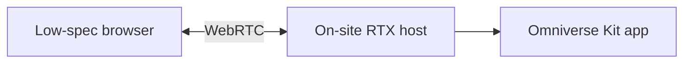

# OpenUSD and Omniverse

Terms: [glossary](glossary.md).

OpenUSD is the spatial source of truth. Omniverse Kit is the 3D app. Neither owns safety rules or process measurements.

This version generates `usd/factory/bugok_factory.usda` from layout YAML and ships Kit extension shells that call the HTTP API. Kit itself and WebRTC streaming run on the site RTX host.

## Root tree

```text
/World
  BugokFactory
    Buildings
      MainFactory
      Office
      RnD
    Production
      Drawing
      Pilger
      HeatTreatment
      Pointing
      Cleaning
      Straightening
      Cutting
      Packaging
    Inspection
      ECT
      Hydro
      Dimension
      Visual
    MaterialHandling
      Racks
      Cranes
    Utilities
```

Drawing 4 prim: `/World/BugokFactory/Production/Drawing/Drawing_04` references `usd/assets/drawing/Drawing_04.usda` (Frame, Die, Workpiece, Entry, Exit, StatusIndicator). `proxy` and `render` purposes share that asset. Kit extensions poll `/assets/{id}/state` on a timer. They display backend verdicts; they do not compute safety.

## Asset files

Each important Asset is its own USD file.

```text
assets/drawing/Drawing_04.usd
  proxy
  render
```

Use:

- `payload` for large optional assets
- `proxy` purpose for distant areas
- `render` purpose for the focused machine
- variants for equipment state when useful

## Senior app

- Whole-factory navigation
- Live state overlay
- Status filters
- Timeline of historical Snapshots
- Evaluation Lineage panel
- FEA contour and critical region
- Scenario create and compare

History view must look different from live state.

## Operator app

- Assigned line only
- Current step and key conditions
- Decision: `SAFE`, `UNSAFE`, `ANALYSIS_REQUIRED`, `MANUAL_REVIEW`
- FEA progress when a job is open
- Short status text

Do not show the full senior analysis surface by default.

## Low-spec delivery

RTX render stays on an on-site GPU host. The operator uses a Kit app over WebRTC.



The operator client must not query the Digital Twin database directly. Domain data reaches Kit through the app API and events.

## Twin to 3D map

[config/asset_registry.yaml](../config/asset_registry.yaml) maps:

```text
Asset ID <-> AAS ID <-> OpenUSD prim
```

State changes may update badges, material position, activity, alerts, and FEA overlays. They must not write process values into USD as authority.

## FEA view

Keep with each job:

- `job_id`
- `snapshot_id`
- solver version
- mesh or deformed geometry
- field values and critical-region metadata

UI may show:

1. Undeformed reference
2. Deformed result
3. Selected stress or strain field
4. Critical-region marker
5. Before and after

Demo FEA job ID in docs: `fea-0001`.

## Streaming acceptance

- Streamable Kit app runs on the RTX host
- Chromium client receives WebRTC
- Keyboard and mouse round-trip works
- Operator scope is applied before draw
- Distant areas use proxy or unloaded payload
- Streaming failure never changes a stored Decision
